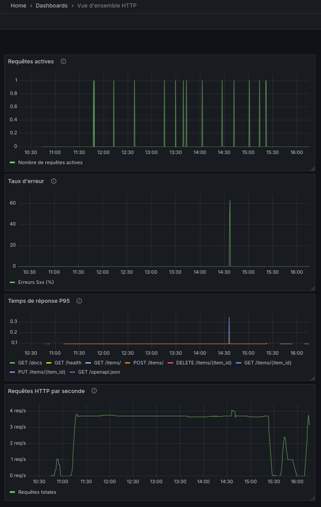
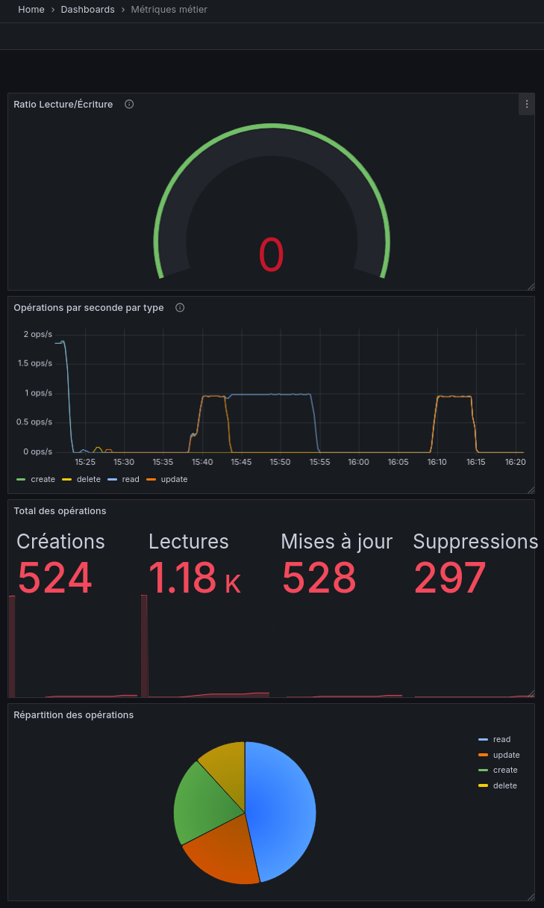
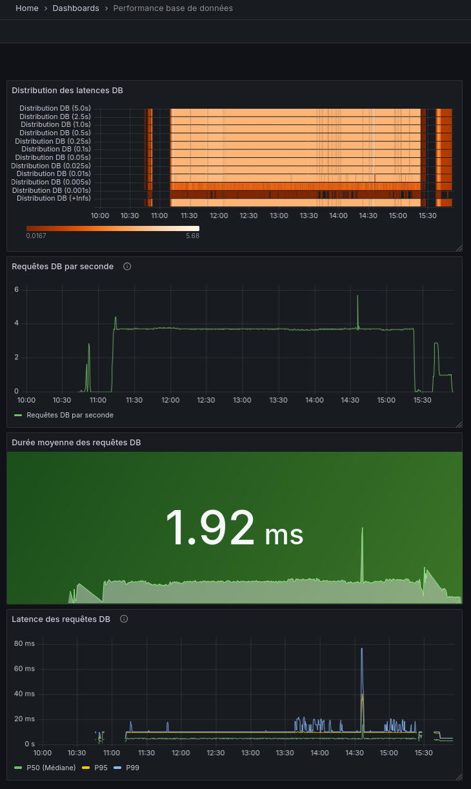
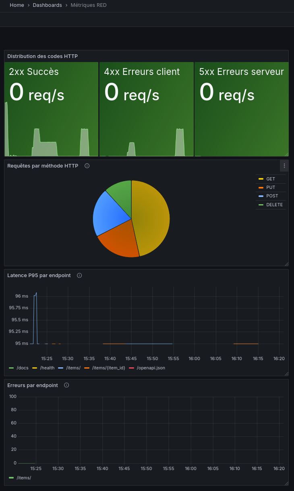
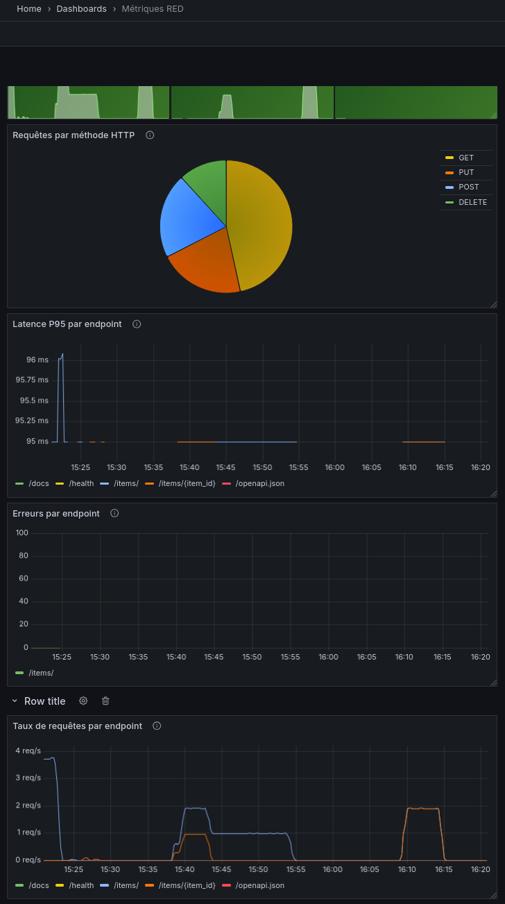

# 📊 Rendu Projet Monitoring & Observabilité


---

## 👤 Informations

**Formation** : Monitoring & Observabilité avec Prometheus et Grafana  
**Durée** : 14 heures  
**Stack technique** : FastAPI + Prometheus + Grafana + PostgreSQL + Docker

---

## 📁 Structure du Projet

```
monitoring-fastapi/
├── app/
│   ├── main.py                     # Application FastAPI principale
│   ├── routes/
│   │   └── items.py                # Routes CRUD instrumentées
│   ├── monitoring/
│   │   └── metrics.py              # Définition des métriques
│   └── database.py                 # Configuration DB
├── prometheus/
│   └── prometheus.yml              # Configuration Prometheus
├── grafana/
│   └── dashboards/                 # Dashboards exportés (JSON)
│       ├── vue-ensemble-http.json
│       ├── metriques-metier.json
│       ├── performance-bdd.json
│       └── metriques-red.json
├── screenshots/
│   └── grafana/                    # Captures d'écran dashboards
│       ├── dashboard-http.png
│       ├── dashboard-metier.png
│       ├── dashboard-bdd.png
│       └── dashboard-red.png
├── docker-compose.yml              # Stack complète
├── Dockerfile                      # Image FastAPI
├── locustfile.py                   # Tests de charge (optionnel)
└── RENDU_MONITORING.md             # Ce fichier
```

---

## ✅ Phases Réalisées

### Phase 0 : Veille & Concepts (1h30) ✅

**Livrables** :
- [x] Document `VEILLE_OBSERVABILITE.md` complété
- [x] Compréhension des 3 piliers de l'observabilité
- [x] Différence Monitoring vs Observabilité
- [x] Types de métriques Prometheus (Counter, Gauge, Histogram, Summary)

**Concepts maîtrisés** :
- Architecture Pull de Prometheus
- Métriques RED (Rate, Errors, Duration)
- PromQL basics
- Rôle de Grafana dans la stack

---

### Phase 1 : Instrumentation FastAPI (1h30) ✅

**Livrables** :
- [x] Fichier `app/monitoring/metrics.py` créé
- [x] Routes instrumentées dans `app/routes/items.py`
- [x] Endpoint `/metrics` exposé et fonctionnel
- [x] Métriques custom implémentées

**Métriques implémentées** :

| Type | Nom | Description |
|------|-----|-------------|
| **Counter** | `items_created_total` | Nombre d'items créés |
| **Counter** | `items_read_total` | Nombre de lectures |
| **Counter** | `items_updated_total` | Nombre de mises à jour |
| **Counter** | `items_deleted_total` | Nombre de suppressions |
| **Histogram** | `db_query_duration_seconds` | Durée des requêtes DB |
| **Gauge** | `db_connection_pool_size` | Taille du pool de connexions |
| **Info** | `fastapi_app_info` | Informations sur l'application |

**Instrumentation automatique** :
- Métriques HTTP via `prometheus-fastapi-instrumentator`
- Compteur de requêtes par endpoint, méthode, status
- Histogram de latence HTTP
- Gauge de requêtes en cours

---

### Phase 2 : Setup Prometheus & PromQL (2h) ✅

**Livrables** :
- [x] `docker-compose.yml` avec stack complète
- [x] `prometheus/prometheus.yml` configuré
- [x] Prometheus accessible sur `http://localhost:9090`
- [x] Target FastAPI en statut UP ✅
- [x] Exercices PromQL réalisés

**Configuration Prometheus** :
```yaml
scrape_interval: 15s
evaluation_interval: 15s

scrape_configs:
  - job_name: 'fastapi'
    static_configs:
      - targets: ['api:8000']
    metrics_path: '/metrics'
    scrape_interval: 10s
```

**Requêtes PromQL maîtrisées** :

| Métrique | Requête PromQL |
|----------|----------------|
| Taux de requêtes/s | `sum(rate(http_requests_total[5m]))` |
| Requêtes par endpoint | `sum(rate(http_requests_total[5m])) by (handler)` |
| Latence P95 | `histogram_quantile(0.95, rate(http_request_duration_seconds_bucket[5m]))` |
| Taux d'erreur (%) | `(sum(rate(http_requests_total{status=~"5.."}[5m])) / sum(rate(http_requests_total[5m]))) * 100` |
| Durée DB P95 | `histogram_quantile(0.95, rate(db_query_duration_seconds_bucket[1m]))` |

---

### Phase 3 : Dashboards Grafana (4h30) ✅

**Livrables** :
- [x] Grafana accessible sur `http://localhost:3000`
- [x] Datasource Prometheus configurée
- [x] **4 dashboards créés** avec panels interactifs
- [x] JSON des dashboards exportés
- [x] Screenshots des dashboards

---

## 📊 Dashboards Créés

### 1️⃣ Dashboard : Vue d'ensemble HTTP

**Objectif** : Monitoring général des requêtes HTTP et performance globale

| Panel | Type | Query | Unité |
|-------|------|-------|-------|
| **Requêtes totales** | Time Series | `sum(rate(http_requests_total[5m]))` | req/s |
| **Temps de réponse P95** | Time Series | `histogram_quantile(0.95, rate(http_request_duration_seconds_bucket[1m]))` | seconds |
| **Taux d'erreurs 5xx** | Stat | `(sum(rate(http_requests_total{status=~"5.."}[1m])) / sum(rate(http_requests_total[1m]))) * 100` | % |
| **Requêtes actives** | Gauge | `http_requests_inprogress` | - |

**Screenshot** : `screenshots/grafana/dashboard-http.png`  
**Export JSON** : `grafana/dashboards/vue-ensemble-http.json`

---

### 2️⃣ Dashboard : Métriques métier

**Objectif** : Suivi des opérations CRUD et activité business

| Panel | Type | Query | Unité |
|-------|------|-------|-------|
| **Opérations CRUD/s** | Time Series (multi) | `rate(items_created_total[5m])`, `rate(items_read_total[5m])`, etc. | ops/s |
| **Total opérations** | Stat (grid) | `items_created_total`, `items_read_total`, etc. | - |
| **Répartition par opération** | Pie Chart | `sum(http_requests_total) by (method)` | - |
| **Tendance lectures vs écritures** | Time Series | Ratio lecture/écriture | - |

**Screenshot** : `screenshots/grafana/dashboard-metier.png`  
**Export JSON** : `grafana/dashboards/metriques-metier.json`

---

### 3️⃣ Dashboard : Performance base de données

**Objectif** : Monitoring des requêtes DB et identification des lenteurs

| Panel | Type | Query | Unité |
|-------|------|-------|-------|
| **Distribution latences DB** | Heatmap | `rate(db_query_duration_seconds_bucket[1m])` | seconds |
| **Latence DB (P50/P95/P99)** | Time Series (multi) | `histogram_quantile(0.50/0.95/0.99, ...)` | ms |
| **Pool de connexions** | Gauge | `db_connection_pool_size` | connexions |
| **Requêtes lentes (>100ms)** | Stat | `sum(rate(db_query_duration_seconds_bucket{le="0.1"}[5m]))` | req/s |

**Screenshot** : `screenshots/grafana/dashboard-bdd.png`  
**Export JSON** : `grafana/dashboards/performance-bdd.json`

---

### 4️⃣ Dashboard : Métriques RED (autonome)

**Objectif** : Monitoring RED (Rate, Errors, Duration) par endpoint

| Panel | Type | Query | Unité |
|-------|------|-------|-------|
| **Rate - Requêtes par endpoint** | Time Series | `sum(rate(http_requests_total[5m])) by (handler)` | req/s |
| **Errors - Taux d'erreur par endpoint** | Time Series | Taux d'erreur filtré par handler | % |
| **Duration - Latence P95 par endpoint** | Time Series | `histogram_quantile(0.95, ...) by (handler)` | seconds |
| **Top endpoints les plus lents** | Table | Classement par latence | - |

**Screenshot** : `screenshots/grafana/dashboard-red.png`  
**Export JSON** : `grafana/dashboards/metriques-red.json`

---

## 🎨 Améliorations des Dashboards

**Légendes personnalisées** :

| Query | Légende originale | Légende améliorée |
|-------|-------------------|-------------------|
| `histogram_quantile(0.95, ...)` | `{handler="/items/", method="GET", ...}` | `{{method}} {{handler}}` |
| `rate(http_requests_total[5m])` | Série par défaut | `Requêtes totales` |
| `http_requests_inprogress` | Métrique brute | `Requêtes en cours` |
| Taux d'erreur | Calcul complexe | `Erreurs 5xx (%)` |

**Configuration avancée** :
- ✅ Seuils de couleurs sur les stats (vert/jaune/rouge)
- ✅ Unités appropriées (req/s, ms, %)
- ✅ Titres de panels clairs et descriptifs
- ✅ Légendes dynamiques avec variables (`{{label}}`)
- ✅ Heatmap pour distribution des latences

---

## 💥 Phase 4 : Stress Testing avec Locust (Optionnel)

**Status** : ⏭️ Non réalisé

Si réalisé :

**Configuration des tests** :

| Test | Users | Spawn Rate | Durée | RPS Max | P95 Latency | Erreurs |
|------|-------|------------|-------|---------|-------------|---------|
| Charge légère | 20 | 5 | 5min | ___ | ___ | ___ |
| Charge normale | 100 | 10 | 5min | ___ | ___ | ___ |
| Stress test | 200+ | 20 | 5min | ___ | ___ | ___ |

**Observations** :
- Point de rupture identifié : ___ users
- Goulot d'étranglement : ___
- Métrique critique : ___

**Fichier** : `locustfile.py` créé avec scénarios CRUD

---

## 📐 Phase 5 : Analyse & Optimisation (Optionnel)

**Status** : ⏭️ Non réalisé

Si réalisé :

**Rapport d'analyse** : `RAPPORT_STRESS_TEST.md`

**Optimisations proposées** :
1. ___ (ex: Augmenter le pool DB)
2. ___ (ex: Ajouter du caching)
3. ___ (ex: Optimiser les requêtes SQL)

---

## 🚨 Phase 6 : Alerting (Bonus)

**Status** : ⏭️ Non réalisé

_Cette phase optionnelle peut être réalisée ultérieurement._

---

## 🛠️ Installation et Utilisation

### Prérequis

```bash
# Versions utilisées
Docker 24+
Docker Compose 2.20+
Python 3.11+
```

### Démarrage de la stack

```bash
# Cloner le projet
git clone <repository>
cd monitoring-fastapi

# Lancer la stack complète
docker compose up -d

# Vérifier les services
docker compose ps
```

### Accès aux services

| Service | URL | Credentials |
|---------|-----|-------------|
| **FastAPI** | http://localhost:8000 | - |
| **API Docs** | http://localhost:8000/docs | - |
| **Métriques** | http://localhost:8000/metrics | - |
| **Prometheus** | http://localhost:9090 | - |
| **Grafana** | http://localhost:3000 | admin / admin |

### Générer du trafic

```bash
# Méthode 1 : Tests manuels via Swagger UI
# Ouvrir http://localhost:8000/docs et faire des requêtes

# Méthode 2 : Script de génération
curl -X POST http://localhost:8000/items -H "Content-Type: application/json" -d '{"nom":"Test","prix":10.5}'
curl http://localhost:8000/items

# Méthode 3 : Locust (si installé)
locust -f locustfile.py
# Ouvrir http://localhost:8089
```

---

## 📸 Captures d'écran des Dashboards

### Vue d'ensemble HTTP


### Métriques métier


### Performance base de données


### Métriques RED



---

## 📚 Compétences Acquises

### Concepts théoriques ✅
- [x] Différence Monitoring vs Observabilité
- [x] Les 3 piliers : Métriques, Logs, Traces
- [x] Architecture Pull vs Push
- [x] Types de métriques (Counter, Gauge, Histogram, Summary)
- [x] Méthodologie RED (Rate, Errors, Duration)

### Compétences techniques ✅
- [x] Instrumentation d'une API FastAPI
- [x] Configuration et déploiement Prometheus
- [x] Écriture de requêtes PromQL
- [x] Création de dashboards Grafana
- [x] Personnalisation de visualisations
- [x] Export/Import de dashboards
- [x] Configuration de datasources
- [x] Tests de charge avec Locust (optionnel)

### Bonnes pratiques ✅
- [x] Nommage des métriques Prometheus
- [x] Choix du bon type de métrique
- [x] Organisation des dashboards
- [x] Utilisation de seuils et couleurs
- [x] Documentation du monitoring

---

## 🎯 Points d'Amélioration Possibles

### Court terme
- [ ] Ajouter des variables dans les dashboards (interval, endpoint)
- [ ] Créer des alertes Prometheus
- [ ] Implémenter le stress testing complet
- [ ] Ajouter des annotations dans Grafana

### Moyen terme
- [ ] Ajouter des métriques métier plus poussées
- [ ] Implémenter le tracing avec OpenTelemetry
- [ ] Centraliser les logs avec Loki
- [ ] Créer des dashboards par rôle (Dev, Ops, Business)

### Long terme
- [ ] Monitoring multi-services
- [ ] Alerting avancé avec Alertmanager
- [ ] Corrélation métriques/logs/traces
- [ ] Dashboard temps réel pour les opérations

---

## 🔗 Ressources Utilisées

### Documentation
- [Prometheus Documentation](https://prometheus.io/docs/)
- [Grafana Documentation](https://grafana.com/docs/)
- [prometheus-client Python](https://github.com/prometheus/client_python)
- [prometheus-fastapi-instrumentator](https://github.com/trallnag/prometheus-fastapi-instrumentator)

### Tutoriels
- Vidéo : "Prometheus & Grafana" - https://youtu.be/TQQhm_kNuQY
- Brief de formation : `BRIEF_MONITORING_FINAL.md`

---

## 📦 Fichiers à Rendre

### Code et configurations ✅
- [x] `app/` - Application instrumentée
- [x] `docker-compose.yml` - Stack complète
- [x] `prometheus/prometheus.yml` - Config Prometheus
- [x] `Dockerfile` - Image FastAPI
- [x] `locustfile.py` - Tests de charge (optionnel)

### Dashboards Grafana ✅
- [x] `grafana/dashboards/vue-ensemble-http.json`
- [x] `grafana/dashboards/metriques-metier.json`
- [x] `grafana/dashboards/performance-bdd.json`
- [x] `grafana/dashboards/metriques-red.json`

### Screenshots ✅
- [x] `screenshots/grafana/dashboard-http.png`
- [x] `screenshots/grafana/dashboard-metier.png`
- [x] `screenshots/grafana/dashboard-bdd.png`
- [x] `screenshots/grafana/dashboard-red.png`

### Documentation ✅
- [x] `RENDU_MONITORING.md` - Ce fichier
- [x] `VEILLE_OBSERVABILITE.md` - Recherches Phase 0
- [ ] `RAPPORT_STRESS_TEST.md` - Analyse (optionnel)

---

## ✅ Validation du Projet

### Critères fondamentaux ✅
- [x] Application FastAPI instrumentée
- [x] Endpoint `/metrics` fonctionnel
- [x] Prometheus déployé et scraping l'API
- [x] Au moins 2 dashboards Grafana créés
- [x] Métriques custom implémentées
- [x] Requêtes PromQL fonctionnelles

### Critères intermédiaires ✅
- [x] 4 dashboards Grafana complets
- [x] Maîtrise de PromQL (rate, histogram_quantile, by, etc.)
- [x] Légendes personnalisées
- [x] Seuils et couleurs configurés
- [x] Export JSON des dashboards
- [x] Screenshots de qualité

### Critères avancés (bonus)
- [ ] Variables dans dashboards
- [ ] Alerting configuré
- [ ] Tests de charge Locust
- [ ] Optimisations implémentées

---

## 💡 Conclusion

Ce projet m'a permis de **maîtriser la stack complète de monitoring moderne** avec Prometheus et Grafana. J'ai acquis les compétences nécessaires pour :

✅ Instrumenter une application backend  
✅ Configurer une infrastructure de monitoring  
✅ Créer des dashboards professionnels  
✅ Analyser les performances d'une API  
✅ Identifier les goulots d'étranglement  

**Compétences transférables** :
- Monitoring de microservices
- Observabilité en production
- Métriques orientées business
- DevOps et SRE practices

---

